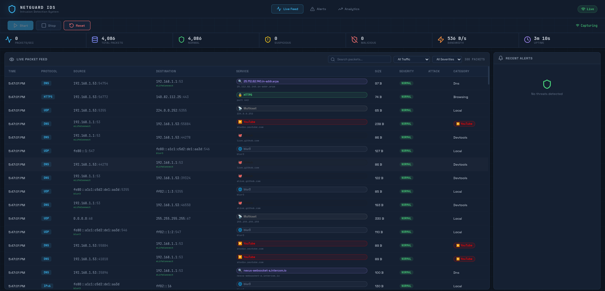
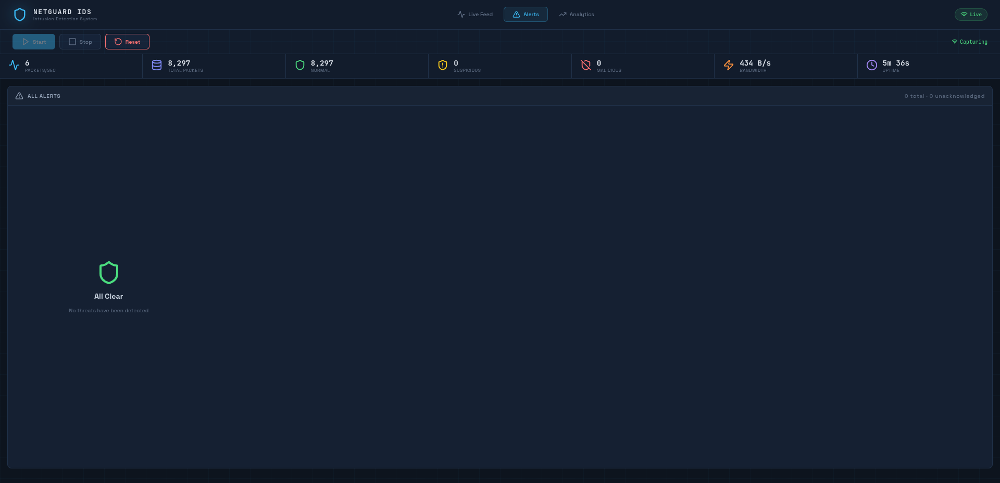
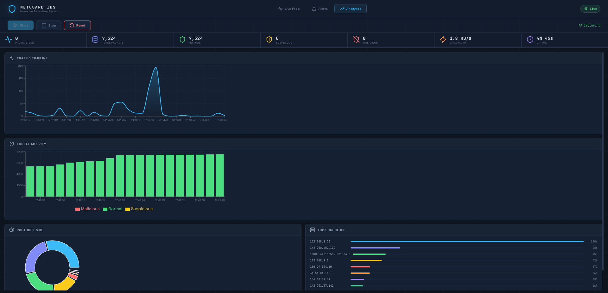

# ORION — Operational Reconnaissance & Intelligent Observation Network

> A real-time Network Intrusion Detection System (IDS) with a live web dashboard.

ORION watches every packet flowing through your network interface — exactly like Wireshark — analyzes them for threats, and streams everything live to a React dashboard over WebSocket. It recognizes 80+ services (YouTube, WhatsApp, Google Meet, Netflix, Discord, and more), categorizes traffic into 14 types, and fires precise security alerts without noisy false positives.





---

## What is ORION? (Beginner Friendly)

**In plain English:** ORION sits silently in the background and reads all the network traffic on your computer. It figures out *where* each packet is going (YouTube? Discord? Some unknown IP?), *what kind* of traffic it is, and whether it looks like an attack. Everything is shown live in a browser dashboard you can open at `http://localhost:3000`.

**What is an IDS?** An Intrusion Detection System watches network traffic and raises an alarm when it sees suspicious patterns — like someone scanning your ports, flooding you with packets, or a device on your network doing something it shouldn't.

**Do I need to be an expert?** No. You need Python, Node.js, and the ability to run a terminal. This guide walks you through every step.

---

## Features

| Feature | What it means for you |
|---------|----------------------|
| **Live packet capture** | See every network packet in real time, just like Wireshark |
| **TLS SNI extraction** | Identifies HTTPS websites without decrypting your traffic |
| **80+ known services** | Recognizes Google, YouTube, WhatsApp, Netflix, Spotify, Discord, Slack, Zoom, GitHub, and more |
| **14 traffic categories** | Groups traffic into Streaming, Social, VoIP, Gaming, DNS, LAN, and more |
| **9 threat detectors** | Catches ARP Spoofing, SYN Floods, Port Scans, ICMP Floods, DNS Tunneling, and more |
| **Zero false-positive design** | Normal LAN traffic (Docker, NTP, mDNS) is never flagged as an attack |
| **WebSocket live feed** | Sub-100ms streaming — the dashboard updates instantly |
| **REST API** | Query events, alerts, and stats programmatically |
| **SQLite persistence** | All packets and alerts are saved locally for later review |
| **Simulation mode** | Works without root or Scapy — great for UI development or quick demos |

---

## Project Structure

```
ORION_IDS/
├── backend/                        ← Python server (FastAPI + Scapy)
│   ├── main.py                     # REST API + WebSocket server entry point
│   ├── requirements.txt            # Python dependencies
│   ├── core/
│   │   ├── capture.py              # Raw packet capture using Scapy
│   │   ├── detector.py             # Rule-based threat detection engine
│   │   └── engine.py               # Ties capture → detection → broadcast together
│   └── db/
│       └── database.py             # SQLite database models and async session
│
└── frontend/                       ← React web dashboard
    ├── package.json                # JavaScript dependencies
    └── src/
        ├── App.jsx                 # Main UI — tabs, packet table, alerts, charts
        ├── App.css                 # Dark theme stylesheet
        ├── index.js                # React entry point
        ├── hooks/
        │   └── useIDSWebSocket.js  # WebSocket hook with reconnect + throttling
        └── utils/
            ├── serviceResolver.js  # 5-tier service identification logic
            └── classifier.js       # 14-category traffic classifier
```

---

## Quick Start

### Step 0 — Check Prerequisites

You need the following tools installed before you begin:

| Tool | Minimum Version | How to check | Download link |
|------|----------------|--------------|---------------|
| **Python** | 3.11+ | `python --version` | [python.org/downloads](https://www.python.org/downloads/) |
| **pip** | any | `pip --version` | Included with Python |
| **Node.js** | 18+ | `node --version` | [nodejs.org](https://nodejs.org/) |
| **npm** | any | `npm --version` | Included with Node.js |
| **Git** | any | `git --version` | [git-scm.com](https://git-scm.com/downloads) |

> **Windows users:** For live packet capture you need to run the terminal as **Administrator** (right-click the terminal icon → *"Run as Administrator"*). This is the Windows equivalent of `sudo`.

> **Not ready to do all that?** Skip to Step 2b — ORION works in **Simulation Mode** without root/admin or Scapy.

---

### Step 1 — Clone the Repository

```bash
git clone https://github.com/Blur141/ORION_IDS.git
cd ORION_IDS
```

You now have the full project on your machine.

---

### Step 2 — Set Up the Backend (Python)

The backend is a Python server. We use a **virtual environment** (venv) to keep ORION's dependencies isolated from the rest of your system. Think of it as a clean sandbox just for this project.

#### 2a — Create the Virtual Environment

Open a terminal inside the project root (`ORION_IDS/`):

**Windows (Command Prompt or PowerShell):**
```cmd
cd backend
python -m venv .venv
```

**macOS / Linux:**
```bash
cd backend
python3 -m venv .venv
```

This creates a `.venv` folder inside `backend/`. You only need to do this once.

---

#### 2b — Activate the Virtual Environment

You must activate the venv every time you open a new terminal for the backend.

**Windows (PowerShell):**
```powershell
.venv\Scripts\Activate.ps1
```

**Windows (Command Prompt):**
```cmd
.venv\Scripts\activate.bat
```

**macOS / Linux:**
```bash
source .venv/bin/activate
```

After activation your prompt changes to show `(.venv)` at the start — that confirms it's active:
```
(.venv) PS C:\...\ORION_IDS\backend>
```

> **PowerShell execution policy error?** Run this once in PowerShell (as Administrator):
> ```powershell
> Set-ExecutionPolicy -ExecutionPolicy RemoteSigned -Scope CurrentUser
> ```
> Then try activating again.

---

#### 2c — Install Python Dependencies

With the venv active, install all required packages:

```bash
pip install -r requirements.txt
```

You should see pip downloading and installing packages. This also only needs to be done once (or after a `git pull` that adds new dependencies).

---

#### 2d — Run the Backend Server

**Linux / macOS** — `sudo` is required for raw packet capture:
```bash
sudo .venv/bin/uvicorn main:app --host 0.0.0.0 --port 8000 --reload
```

**Windows** — run the terminal as Administrator, then (with venv active):
```powershell
uvicorn main:app --host 0.0.0.0 --port 8000 --reload
```

**No admin rights or just want to try the UI?** Run normally — ORION auto-enables Simulation Mode:
```bash
uvicorn main:app --host 0.0.0.0 --port 8000 --reload
```

A successful start looks like this:
```
INFO:     Started server process [12345]
INFO:     Uvicorn running on http://0.0.0.0:8000 (Press CTRL+C to quit)
INFO:     Auto-detected interface: Wi-Fi
INFO:     IDS system ready — live capture mode
```

> **Simulation Mode:** If ORION can't access the network interface (no admin rights, no Scapy), it automatically generates realistic synthetic traffic so you can explore the full dashboard. A `simulation` badge appears in the top-right corner of the UI — no extra setup needed.

**Leave this terminal open.** The backend must keep running while you use the dashboard.

---

### Step 3 — Set Up the Frontend (React)

Open a **second, separate terminal** (keep the backend terminal from Step 2 running).

```bash
# Navigate to the frontend folder from the project root
cd ORION_IDS/frontend

# Install all JavaScript dependencies (first time only)
npm install

# Start the React development server
npm start
```

`npm install` downloads packages into a `node_modules/` folder — this takes 1–2 minutes on first run. After that, `npm start` is instant.

Your browser should open automatically at [http://localhost:3000](http://localhost:3000).
If it doesn't, open it manually — the dashboard connects to the backend on its own.

---

### Step 4 — You're Live!

You now have:
- **Terminal 1** — Backend running on `http://localhost:8000`
- **Terminal 2** — Frontend running on `http://localhost:3000`

Open [http://localhost:3000](http://localhost:3000) in your browser. The Live Feed tab will start populating with packets immediately. In **live mode** (admin/root) you see your real network traffic. In **simulation mode** you see generated traffic — fully functional for exploring all features.

---

### Full Setup at a Glance

```
# Terminal 1 — Backend
git clone https://github.com/Blur141/ORION_IDS.git
cd ORION_IDS/backend
python -m venv .venv
# Windows:  .venv\Scripts\Activate.ps1
# Mac/Linux: source .venv/bin/activate
pip install -r requirements.txt
uvicorn main:app --host 0.0.0.0 --port 8000 --reload   # add sudo on Linux/macOS

# Terminal 2 — Frontend
cd ORION_IDS/frontend
npm install
npm start
```

---

## Configuration

### Environment Variables (Optional)

If your backend runs on a different host or port, create a `.env` file inside `frontend/`:

```env
REACT_APP_WS_URL=ws://localhost:8000/ws
REACT_APP_API_URL=http://localhost:8000
```

The defaults point to `localhost:8000`, which is correct for local development.

---

### Changing the Network Interface

ORION auto-detects your best interface (prefers Wi-Fi over Ethernet, skips virtual adapters). To override it, edit `backend/main.py`:

```python
# Examples:
ids_engine = IDSEngine(interface="eth0")   # Linux Ethernet
ids_engine = IDSEngine(interface="en0")    # macOS Wi-Fi
ids_engine = IDSEngine(interface="Wi-Fi")  # Windows Wi-Fi
```

To see all available interfaces on your machine:

```python
from core.capture import get_available_interfaces
print(get_available_interfaces())
```

---

### Filtering Noisy Traffic (BPF Filter)

To exclude specific traffic from capture (e.g. hide your own SSH connections):

```python
# In backend/core/engine.py — find the PacketCapture(...) call
PacketCapture(interface=best_iface, bpf_filter="not port 22")
```

BPF (Berkeley Packet Filter) syntax is the same as Wireshark capture filters.

---

## How It Works

### Capture Pipeline

```
Your Network Interface  (promiscuous mode — sees all packets)
         │
         ▼
   Scapy sniff()  ──────────────────────── runs in a background thread
         │
         ▼
   _parse_packet()   ← extracts IPs, ports, protocols, DNS, TLS SNI, HTTP
         │
         ▼
   Queue  (buffer of up to 10,000 packets)
         │
         ▼
   process_loop()    ← async consumer that processes the queue
         │
         ├──► DetectionEngine.analyze()   → flags severity + attack type
         │
         ├──► WebSocket broadcast         → live update to React dashboard
         │
         └──► SQLite write                → persistent storage
```

### Service Identification (5-Tier)

For every packet, ORION tries to identify the service in this order:

1. **TLS SNI** — reads the domain from the raw TLS ClientHello; works for all HTTPS without decryption
2. **DNS query** — if the packet is a DNS lookup, the queried domain is used directly
3. **Reverse DNS hostname** — looks up the source/destination IP in the OS resolver cache
4. **IP prefix** — maps well-known IP ranges (e.g. `142.250.x` → Google, `104.16.x` → Cloudflare)
5. **Port number** — last resort fallback (port 443 → HTTPS, port 22 → SSH, etc.)

### Traffic Categories

| Category | Examples |
|----------|---------|
| Streaming | YouTube, Netflix, Spotify, Twitch, Disney+ |
| Social | Facebook, Instagram, Twitter/X, Reddit, LinkedIn |
| VoIP / Video | Google Meet, Zoom, Discord, MS Teams |
| Messaging | WhatsApp, Telegram, Signal, Slack |
| Cloud / CDN | AWS, Cloudflare, Akamai, Fastly, iCloud |
| Web Browsing | Generic HTTPS/HTTP to unknown external IPs |
| System / OS | Windows Update, Apple telemetry, NTP, analytics |
| DNS | DNS queries and responses |
| LAN / Local | ARP, mDNS, SSDP, SMB, Docker internal |
| Security / VPN | VPN services, PKI/OCSP, IKE |
| Database | MySQL, PostgreSQL, Redis, MongoDB |
| Dev Tools | GitHub, SSH, npm, GitLab |
| Other | Unclassified traffic |

### Threat Detectors

| Detector | What triggers it | Severity |
|----------|-----------------|----------|
| **ARP Spoofing** | A device's IP→MAC mapping suddenly changes | Malicious |
| **SYN Flood** | 100+ SYN packets per second from the same IP | Malicious |
| **Port Scan** | 20+ unique ports probed from one source | Suspicious / Malicious |
| **ICMP Flood** | 50+ ICMP packets per second from same IP | Malicious |
| **DNS Tunneling** | 30+ DNS queries per second from same IP | Suspicious |
| **DNS Anomaly** | DGA patterns, high-risk TLDs, C2-like keywords | Suspicious |
| **Credential Leakage** | Plaintext passwords or API keys in HTTP | Malicious |
| **Brute Force** | 15+ SYNs to an auth port from an external IP | Malicious |
| **Low TTL Anomaly** | TCP packet with TTL ≤ 3 from an external IP | Suspicious |
| **Sensitive Port Access** | External connection to backdoor ports | Suspicious / Malicious |

**Why so few false positives?** ORION uses careful rules to avoid noisy alerts:
- TTL anomaly only fires on TCP — NTP, mDNS, SSDP use TTL=1 on UDP legitimately
- Port scan skips LAN-to-LAN traffic — SMB, Bonjour, and printer discovery are normal
- Brute force only fires on external source IPs — local SSH access is expected
- ARP anomaly ignores Docker virtual MAC prefixes (`02:xx`, `0a:xx`, `52:xx`)

---

## Dashboard Guide

### Live Feed Tab
- Real-time table of every captured packet
- Columns: time, protocol, source IP, destination IP, service badge, size, severity, attack type, category
- Search bar filters across all fields instantly
- Row colors: **yellow border** = suspicious, **red border** = malicious

### Alerts Tab
- Card grid of all fired security alerts
- Click **Acknowledge** to mark an alert as reviewed
- Unacknowledged count shown as a badge on the tab

### Analytics Tab
- **Traffic Timeline** — rolling bandwidth chart (KB/s over the last 30 samples)
- **Threat Activity** — stacked bar chart of Normal / Suspicious / Malicious counts
- **Protocol Mix** — donut chart showing protocol distribution
- **Top Source IPs** — horizontal bar chart of the most active source IPs

---

## REST API Reference

The backend exposes a REST API you can call from any HTTP client (curl, Postman, browser):

| Method | Endpoint | Description |
|--------|----------|-------------|
| `GET` | `/api/status` | Engine status and live stats |
| `GET` | `/api/stats` | Packet counts, bandwidth, protocol distribution |
| `GET` | `/api/events` | Recent network events (filter by severity, protocol, IP) |
| `GET` | `/api/alerts` | Security alerts (filter by severity, acknowledged) |
| `PATCH` | `/api/alerts/{id}/acknowledge` | Mark an alert as acknowledged |
| `GET` | `/api/analytics/timeline` | Severity counts over the last N hours |
| `POST` | `/api/control/start` | Start packet capture |
| `POST` | `/api/control/stop` | Stop packet capture |
| `POST` | `/api/control/reset` | Reset all counters and in-memory buffers |
| `WS` | `/ws` | Live WebSocket stream |

Interactive API docs are available at [http://localhost:8000/docs](http://localhost:8000/docs) while the backend is running (powered by FastAPI's built-in Swagger UI).

### WebSocket Message Types

```jsonc
// Server → Client messages
{ "type": "init",   "data": { "recent_packets": [...], "recent_alerts": [...], "stats": {...} } }
{ "type": "packet", "data": { "src_ip": "...", "dst_ip": "...", "protocol": "HTTPS", ... } }
{ "type": "alert",  "data": { "alert_type": "Port Scan", "severity": "suspicious", ... } }
{ "type": "stats",  "data": { "total_packets": 12400, "bandwidth_bps": 204800, ... } }
{ "type": "ping" }
```

---

## Development

### Running Without Root (Simulation Mode)

If Scapy is not installed or you don't have admin/root privileges, ORION automatically falls back to generating realistic synthetic traffic. No configuration needed.

```bash
# Linux/macOS — no sudo
uvicorn main:app --reload

# Windows — normal (non-admin) terminal
uvicorn main:app --reload
```

The dashboard will show a `simulation` badge in the top-right corner.

---

### Adding a New Service

Edit [frontend/src/utils/serviceResolver.js](frontend/src/utils/serviceResolver.js) and add an entry to `DOMAIN_MAP`:

```javascript
{ match: ["example.com", "cdn.example.com"], name: "Example", emoji: "🔥", color: "#FF6B6B" },
```

---

### Adding a New Threat Detector

Edit [backend/core/detector.py](backend/core/detector.py) — add a method and register it in `analyze()`:

```python
def _check_my_attack(self, packet: dict) -> Optional[DetectionResult]:
    # Your detection logic here
    return DetectionResult(severity="suspicious", attack_type="My Attack", description="...", score=70.0)

# Then add it to the detectors list inside analyze():
detectors = [..., self._check_my_attack]
```

---

## Troubleshooting

**"python: command not found" or wrong version**
→ Make sure Python 3.11+ is installed and on your PATH. On some systems the command is `python3` instead of `python`. Check with `python3 --version`.

**"Scripts\Activate.ps1 cannot be loaded" (Windows PowerShell)**
→ Run this once in PowerShell as Administrator:
```powershell
Set-ExecutionPolicy -ExecutionPolicy RemoteSigned -Scope CurrentUser
```
Then activate the venv again.

**"No module named scapy" or "No module named fastapi"**
→ Your virtual environment is probably not active. Look for `(.venv)` at the start of your prompt. If it's missing, run the activate command from Step 2b again, then re-run `pip install -r requirements.txt`.

**Backend doesn't start / "Permission denied" / "Operation not permitted"**
→ Live packet capture needs elevated privileges. Run the terminal as Administrator (Windows) or use `sudo` before `uvicorn` (Linux/macOS). Alternatively, just run without privileges — ORION will use Simulation Mode automatically.

**Dashboard shows nothing / stuck on "Connecting..."**
→ The backend must be running *before* you open the frontend. Check Terminal 1 for errors. Make sure nothing else is using port 8000 (`netstat -ano | findstr 8000` on Windows, `lsof -i :8000` on Mac/Linux).

**"npm: command not found"**
→ Install Node.js from [nodejs.org](https://nodejs.org/). The `npm` command is bundled with it.

**`npm install` fails with EACCES or permission errors (Mac/Linux)**
→ Never use `sudo npm install`. Instead, fix npm permissions: [docs.npmjs.com/resolving-eacces-permissions](https://docs.npmjs.com/resolving-eacces-permissions-errors-when-installing-packages-globally).

**Frontend keeps refreshing but no packets appear**
→ You are in Simulation Mode. Check the badge in the top-right corner of the dashboard. Simulated packets appear a few seconds after startup — this is normal.

**Port 3000 or 8000 already in use**
→ Another process is occupying the port. Either kill it, or start on a different port:
```bash
# Backend on a different port
uvicorn main:app --port 8001 --reload

# Frontend on a different port
PORT=3001 npm start        # Mac/Linux
set PORT=3001 && npm start # Windows CMD
```
Remember to update `REACT_APP_API_URL` and `REACT_APP_WS_URL` in `frontend/.env` if you change the backend port.

---

## Security & Privacy Notes

- **Root/admin privileges** are required only for live capture. Always run on a machine you trust and own.
- **No data leaves your machine.** All capture, analysis, and storage is local.
- **HTTP payloads** are scanned for credential leakage but never stored in full. Only the first 800 bytes are held in memory for detection, never written to the database.
- **HTTPS / TLS traffic is not decrypted.** ORION only reads the SNI hostname, which is sent in plaintext during the TLS handshake by design.

---

## Dependencies

### Backend (Python)

| Package | Purpose |
|---------|---------|
| `fastapi` | REST API and WebSocket server |
| `uvicorn` | ASGI server that runs FastAPI |
| `sqlalchemy` | Async ORM for database access |
| `aiosqlite` | Async SQLite driver |
| `scapy` | Raw packet capture from the network interface |

### Frontend (JavaScript)

| Package | Purpose |
|---------|---------|
| `react` | UI framework |
| `recharts` | Charts (area, bar, pie/donut) |
| `lucide-react` | Icon set |

---

## License

MIT License — see [LICENSE](LICENSE) for details.

---

## Acknowledgements

- [Scapy](https://scapy.net/) — the packet capture engine
- [FastAPI](https://fastapi.tiangolo.com/) — the backend framework
- [Recharts](https://recharts.org/) — dashboard charts
- [Lucide](https://lucide.dev/) — dashboard icons
